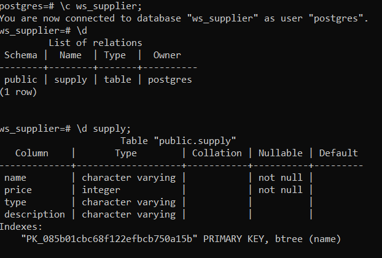

# Tugas Besar 2 - WS-Supplier

## Description

-------
Merupakan layanan daring (Web service) yang menyediakan kebutuhan dalam penyediaan informasi serta jual beli bahan baku yang dapat digunakan dalam rantai suplai pembuatan coklat Willy Wangky.

## Database

-------
Hanya terdapat satu tabel pada database WS-Supplier:

<!-- ## Requirements

-------

1. sad
2. sa
3. dsa

## How to Compile

-------

1. sad
2. s
3. ad
4. asd

## How to Run

-------

1. sad
2. s
3. ad
4. asd

## Known Issues

-------

1. sad
2. sad
3. sad
4. sad -->

## Division of Tasks

-------

1. Setup Project: 13518146
2. Database: 13518146
3. Model: 13518146, 13518135
4. Seed: 13518146
5. Controller + Route:
   - List Data: 13518146
   - Verifikasi: 13518135
6. Testing: 13518146, 13518125, 13518135